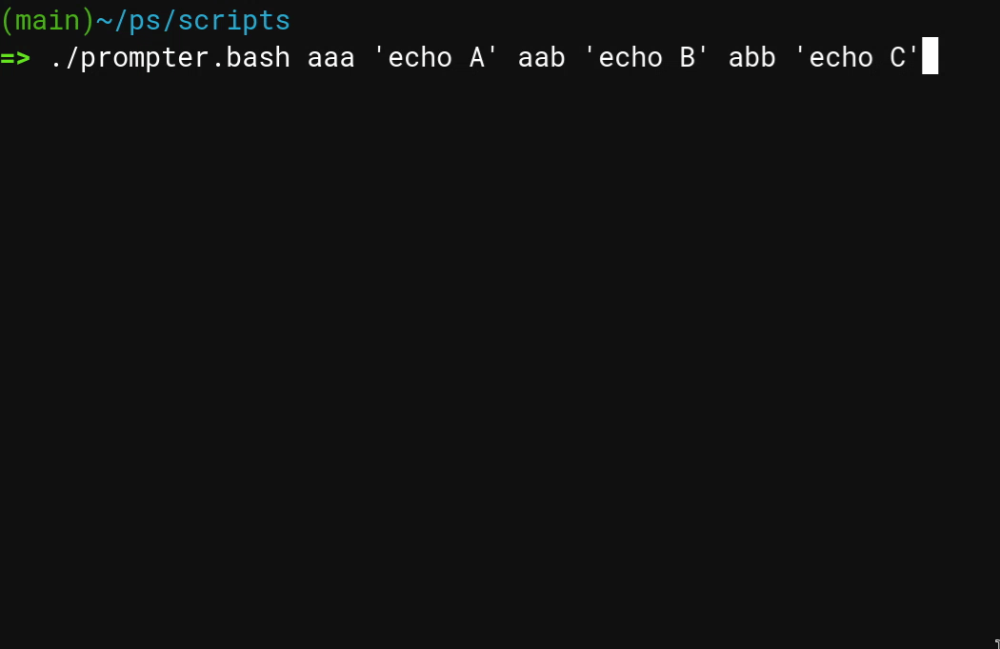
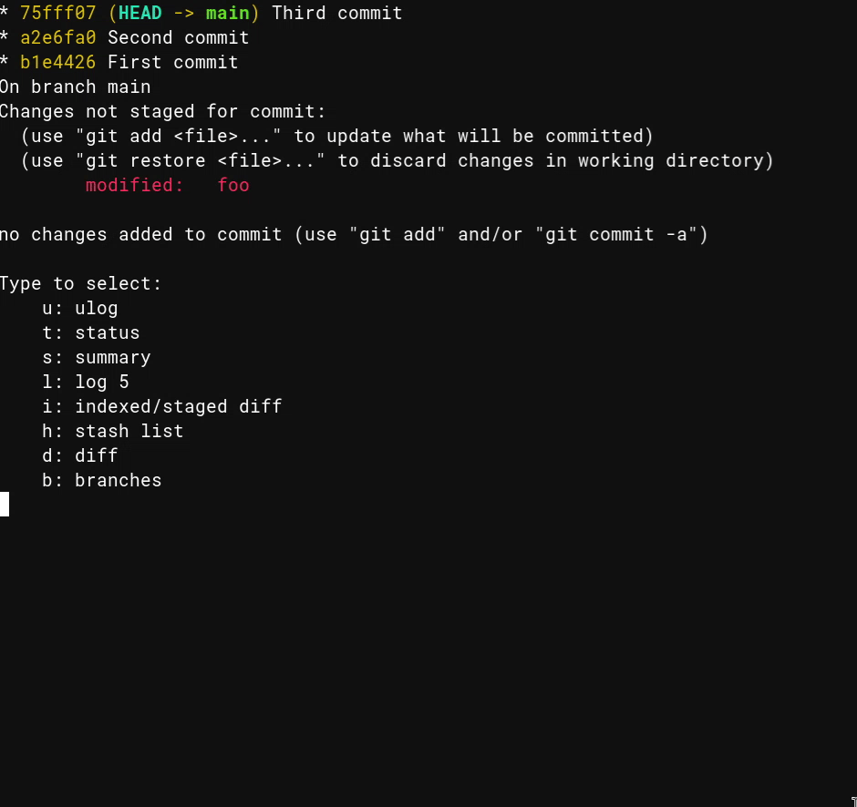

:blogpost: true
:date: 2024-04-26
:tags: blog, bash, shell, utility, scripting
:author: Miro Palmu

Bash quick select prompter utility
----------------------------------

In this blog post I'll showcase flexible utility script :code:`prompter.bash` that I wrote.
It is a `vim-which-key`_ inspired shortcut utility but for a terminal.

.. _`vim-which-key`: https://stackoverflow.com/a/22945024

First there is a :ref:`two gifs <gif showcases>` showcasing the script
followed with more detailed :ref:`git example`.
At the end there is :ref:`usage instructions <usage>` with :ref:`full sources <full sources>`.

.. _gif showcases:

Gif showcases
"""""""""""""

In following gif the keys pressed after enter are :code:`a, a, b`.

This is variation what will be shown in the :ref:`next section <git example>`.

.. _infinite git:

.. _git example:

Git example
"""""""""""

Following invocation of `prompter.bash` (arguments are explained in :ref:`usage`):

.. code-block:: console

    $ /path/to/prompter.bash \
        b "branches # git branch" \
        t "status # git status" \
        s "summary # git log --oneline 5; git status" \
        ls "short log 20 # git log --oneline -n 20" \
        ll "log 5 # git log -n 5" \
        dd "diff # git diff" \
        di "indexed/staged diff # git diff --staged" \
        h "stash list # git stash list"

which can be shortened with e.g. Bash alias :code:`gitp`,
will result in:

.. code-block:: console

    $ gitp
    Type to select:
        ll: log 5
        ls: short log 20
        dd: diff
        di: indexed/staged diff
        t: status
        s: summary
        h: stash list
        b: branches

and terminal will wait for input and update immediatly when any key is pressed.
For example pressing :code:`t`, will result in a executiong of :code:`git status`
after clearing the screen.

However if the typed key does not result in unique command, user is asked for another one,
but with delimited options. For example if after:

.. code-block:: console

    $ gitp
    Type to select:
        ll: log 5
        ls: short log 20
        dd: diff
        di: indexed/staged diff
        t: status
        s: summary
        h: stash list
        b: branches

user types :code:`l`, then options are updated to:

.. code-block:: console

    $ gitp
    Type to select:
        l: log 5
        s: short log 20

after which the user can choose either one by typing :code:`l` or :code:`s`.

One useful thing is to call :code:`gitp` inside a loop:

.. code-block:: bash

    function infinite_gitp() {
        while true; do
            /path/to/prompter.bash \
                b "branches # git branch" \
                t "status # git status" \
                s "summary # git log --oneline 5; git status" \
                ls "short log 20 # git log --oneline -n 20" \
                ll "log 5 # git log -n 5" \
                dd "diff # git diff" \
                di "indexed/staged diff # git diff --staged" \
                h "stash list # git stash list"
            echo
        done

which will result in a convinient way of quering information of git repository on the fly.
See the :ref:`second gif example <infinite git>` for variation of this.

.. _usage:

Usage
"""""

.. code-block:: console

    Usage: prompter [key1 cmd1 [key2 cmd2 [ ... ]]

           Prompter will query keystrokes (x1, x2, ...) until word 'x1x2...':

               A) does not match beginning of any key.
               B) matches uniquely to beginning of 'keyN'.

           In case of:

               A) prompter exits with code 1.
               B) prompter executes 'cmdN'.

           All 'cmdN' are stripped up to first # character.
           This can be used as description for the command.

           If 'key1 cmd1' is missing, usage is printed with exit code 0.

.. _full sources:

Source
""""""

Version 2024-04-26.

.. code-block:: bash

    #!/usr/bin/bash

    function print_usage() {
        echo "Usage: prompter [key1 cmd1 [key2 cmd2 [ ... ]]"
        echo
        echo "       Prompter will query keystrokes (x1, x2, ...) until word 'x1x2...':"
        echo
        echo "           A) does not match beginning of any key."
        echo "           B) matches uniquely to beginning of 'keyN'."
        echo
        echo "       In case of:"
        echo
        echo "           A) prompter exits with code 1."
        echo "           B) prompter executes 'cmdN'."
        echo
        echo "       All 'cmdN' are stripped up to first # character."
        echo "       This can be used as description for the command."
        echo
        echo "       If 'key1 cmd1' is missing, usage is printed with exit code 0."
    }

    # Associative array of (keyN, cmdN) pairs.
    declare -A opts

    if (( ${#*} > 1 )); then
        # Take from
        for (( i=1; i < ${#*}; i+=2)); do
            (( j=i+1 ))
            key="${!i}"
            cmd="${!j}"
            opts["$key"]="$cmd"
        done
    else
        print_usage
        exit 0
    fi

    # Array of the keys.
    declare -a viable_opts="( ${!opts[*]} )"

    currently_typed=""

    # Remove all opts from viable_opts that do not match what is in currently_typed.
    function update_viable_opts() {
        local -a new_viable_opts
        for opt in "${viable_opts[@]}"; do
            [[ "$opt" =~ ^"$currently_typed".*$ ]] && new_viable_opts+=( "$opt" )
        done
        viable_opts=( "${new_viable_opts[@]}" )
    }

    function print_viable_opts() {
        echo "Type to select:"
        for opt in "${viable_opts[@]}"; do
            # Remove everything from first # onwards.
            echo "    ${opt/#$currently_typed/}: ${opts[$opt]/%#*/}"
        done
    }

    function check_for_matched_opts() {
        local num_of_viable_opts="${#viable_opts[@]}"
        if [[ "$num_of_viable_opts" == 0 ]]; then
            echo "Nothing found!"
            exit 1
        elif [[ "$num_of_viable_opts" == 1 ]]; then
            local opt="${viable_opts[0]}"
            # Remove everything up to first #.
            local cmd="${opts[${opt}]/#*#/}"

            if [[ -v PROMPTER_DEBUG ]]; then
                echo "found: ${opt}"
                echo "executing: $cmd"
            fi

            # Clear screen before executing the command.
            tput home
            tput ed

            $cmd
            exit
        fi
    }

    while true; do
        # Will print amount of viable options + 1 rows.
        print_viable_opts
        (( lines_printed = "${#viable_opts[@]}" + 1 ))

        read -s -r -n 1 pressed_key
        currently_typed+="$pressed_key"

        tput cuu "$lines_printed" # Move up.
        tput ed                   # Clear what is below.

        update_viable_opts
        check_for_matched_opts
    done
